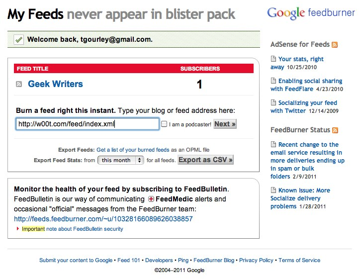

!SLIDE

# Running Jekyll #

!SLIDE code

    @@@ sh
    # To generate your site in _site/
    # Uses defaults if no args specified
    $ jekyll <source path> <output path>

    # To start jekyll on port 4000
    $ jekyll --server

!SLIDE 

# Deployment #

!SLIDE code small

# Set up a remote repo #

    @@@ sh
    $ ssh deploy@slaggle.com
    slaggle$ mkdir myrepo.git
    slaggle$ cd myrepo.git
    slaggle$ git --bare init
    slaggle$ cp hooks/post-receive.sample hooks/post-receive
    slaggle$ mkdir -p /data/myapp

!SLIDE code smaller

    @@@ sh
    # Create a post-recieve hook

    GIT_REPO=$HOME/myrepo.git
    TMP_GIT_CLONE=$HOME/tmp/myrepo
    PUBLIC_WWW=/data/myapp

    git clone $GIT_REPO $TMP_GIT_CLONE
    jekyll --no-auto $TMP_GIT_CLONE $PUBLIC_WWW
    rm -Rf $TMP_GIT_CLONE
    exit

!SLIDE code small

# Deploy #

    @@@ sh
    $ git remote add deploy deploy@slaggle.com:~/myrepo.git
    $ git push deploy master

!SLIDE

# BONUS: FeedBurner #

!SLIDE bullets

# Why FeedBurner? #

* Viewing stats
* Easy-ish to implement
* Portability
* Customizing your feed
* Notification

!SLIDE center

 

!SLIDE code smaller

    location /feed {
        index index.xml;

        # Feedburner redirect
        set $feed_redirect 'http://feeds.feedburner.com/your-site/WnKh';
        if ($http_user_agent ~* "FeedBurner") {
            set $feed_redirect '';
        }
        if ($http_user_agent ~* "FeedValidator") {
            set $feed_redirect '';
        }
        if ($feed_redirect ~* "^(.+)$") {
            rewrite ^ $feed_redirect? permanent;
        }
    }
